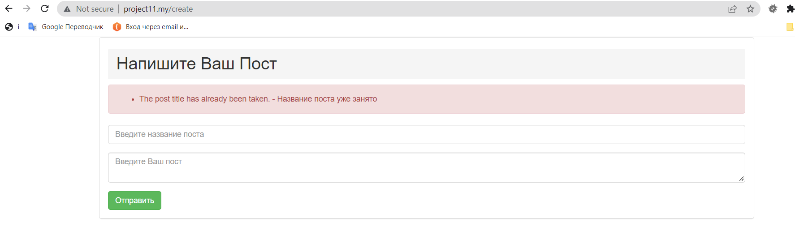

## Домашнее задание № 11.

- Создан новый проект на Laravel Framework 9.17.0. (composer create-project --prefer-dist laravel/laravel project11.my).
- Командой composer require barryvdh/laravel-debugbar --dev в проект добавлен Laravel Debugbar.

- В папке config добавляем ServiceProvider в массив providers (Barryvdh\Debugbar\ServiceProvider::class).
- При помощи Artisan создана таблица posts с полями: id, title, text. На поле title добавлено ограничение unique.
- При помощи Artisan созданы: модель Post и класс PostController.
- В методе PostController-> метод create() возвращает представление с формой создания поста.
- Форма отправляется в метод PostController->store().
- В методе create сохраняем полученные из формы данные.
- Cоздаем пост с помощью полученной формы. Добавляем в форму csrf токен.
- После выполнения запроса на создание поста находим этот запрос в Debugbar(иконка папки), его содержимое SQL-запрос, который был выполнен для создания поста:

- Добавляем вкладку Logs в Debugbar (php artisan vendor:publish --provider="Barryvdh\Debugbar\ServiceProvider)
- Попробуем создать два поста с одинаковым значением title. возникает исключение в файле лога:

- Обработана ошибка уникальности поля title

# Домашнее задание 11.

#### 1. Установите и настройте Laravel Debugbar.

#### 2. При помощи Artisan создайте таблицу posts с полями: id, title, text. На поле title добавьте ограничение unique.

#### 3. При помощи Artisan создайте таблицу posts с полями: id, title, text. На поле title добавьте ограничение unique.

#### 4. В методе PostController->create() должно возвращаться представление с формой создания поста (используя фасад или хелпер). Форма должна отправляться в метод PostController->store().

#### 5. В методе create сохраняйте полученные из формы данные.

#### 6. Попробуйте создать пост с помощью полученной формы. Добавьте в форму csrf токен (используя хелпер или Blade-директиву) и попробуйте еще раз.

#### 7. После выполнения запроса на создание поста найдите этот запрос в Debugbar(иконка папки), просмотрите его содержимое и найдите SQL-запрос, который был выполнен для создания поста.

#### 8. Попробуйте создать два поста с одинаковым значением title. Убедитесь, что возникает исключение и найдите его в файле лога, также попробуйте добавить вкладку Logsв Debugbar.

#### 9*. Подумайте, что нужно сделать, чтобы при создании поста с неуникальным titleне возникало исключение. Попробуйте это реализовать.

 
