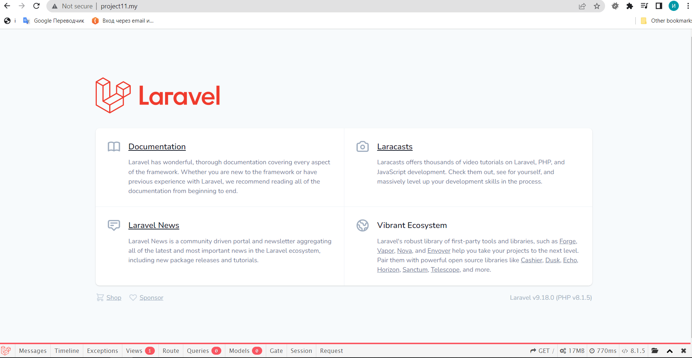
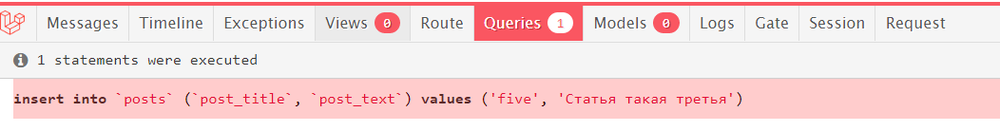
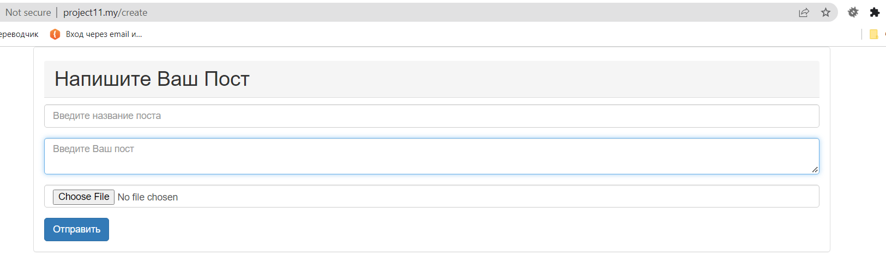
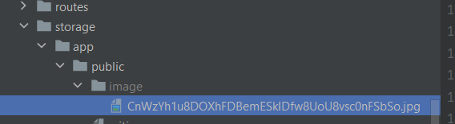

## Домашнее задание № 12.

- Проект сделан на базе проекта домашней работы № 11.
- Добавлен класс StorePostRequest в нем описаны правила валидации, в том числе проверка на уникальность title.
- 
- С помощью миграции в таблицу posts добавлено поле image.

- В форму создания поста добавлено поле с изображением.

- Реализована логика сохранения изображения в методе store контроллера.

- 🛑 Не получилось на данный момент реализовать галерею изображений!
- 🛑 Не получилось добавлять каждой статье свою картинку!

# Домашнее задание 12.

#### 1. Добавьте класс StorePostRequest и опишите в нем правила валидации, в том числе проверку на уникальность title.

#### 2. С помощью миграции добавьте в таблицу posts поле image. В форму создания поста добавьте поле с изображением. Реализуйте логику сохранения изображения в методе store контроллера.

#### 3. При помощи Artisan создайте таблицу posts с полями: id, title, text. На поле title добавьте ограничение unique.

 
